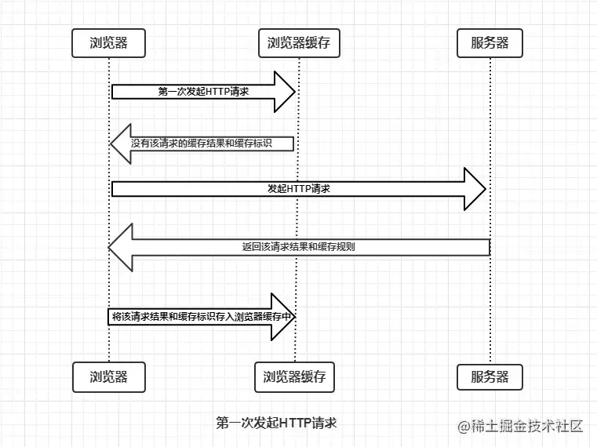

## Vue系列

### 说说你对Vue的理解？

#### 一、Vue是什么

Vue是一套用于构建用户界面的**渐进式框架**。

#### 二、Vue核心特性

##### 数据驱动(MVVM)

MVVM表示的是Model-View-ViewModel

- Model：模型层，负责处理业务逻辑以及和服务端进行交互
- View：视图层，负责将数据模型转化为UI展示出来，可以简单理解为HTML页面
- ViewModel：视图模型层，用来连接Model和View，是Model和View之间的通信桥梁

##### 组件化

什么是组件化一句话来说就是把图形、非图形的合种逻辑均抽象为一个统一的概念（组件）来实现开发的模式，在Vue中的每一个.Vue文件都可以视为一个组件

组件化的优势：

- 降低整个系统的耦合度
- 调试方便
- 提高可维护性

##### 指令系统

指令是带有v-前缀的特殊属性

作用：当表达式的值改变时，将其产生的连带影响，响应式的作用于DOM

常用的指令：

- 条件渲染 v-if
- 列表渲染 v-for
- 属性绑定 v-bind
- 事件绑定 v-on
- 双向数据绑定 v-model
  
#### 三、响应式的核心原理

**vue2.0X**

- 当你把一个普通的JavaScript对象传入Vue实例作为`data`选项，Vue将遍历此对象所有的`property`，并使用`Object.defineProperty`把这些`property`全部转为`getter/setter`
- `Object.defineProperty`是ES5中一个无法shim的特性，这也就是Vue不支持IE8以及更低版本浏览器的原

**vue3.0X**

-  当我们从一个组件的 `data` 函数中返回一个普通的 JavaScript 对象时，Vue 会将该对象包裹在一个带有 `get` 和 `set` 处理程序的 [Proxy](https://developer.mozilla.org/en-US/docs/Web/JavaScript/Reference/Global_Objects/Proxy) 中 
-  `Proxy` 是在 ES6 中引入的，它使 Vue 3 避免了 Vue 早期版本中存在的一些响应性问题。 
-  `Proxy` IE 不支持， 性能由浏览器优化

#### 四、Vue跟传统开发的区别

- Vue所有的界面事件，都只是操作数据的，Jquery操作DOM
- Vue所有数据的变动，都是根据数据自动绑定出来的，Jquery操作DOM

#### 五、Vue和React对比

##### 相同点

- 都有组件化思想
- 都支持服务端渲染
- 都有Virtual DOM（虚拟DOM）
- 数据驱动视图
- 都有支持Native的方案： Vue：weex 、React： native
- 都有自己的构建工具：Vue：vue-cli 、React：Create React App

##### 区别

- 数据流向不同。React从诞生开始就推崇单向数据流，而Vue是双向数据流
- 数据变化的实现原理不同。React使用的是不可变数据，而Vue使用的是可变数据
- 组件化通信的不同。React中通过使用回调函数来进行通信，而Vue中子组件向父组件传递方式有两种：事件和回调函数
- diff算法不同。React主要使用diff队列保存需要更新哪些DOM，得到patch树，再统一操作批量更新DOM。Vue使用双向指针，边对比，边更新DOM

### SPA（单页应用）首屏加载速度慢怎么解决？

#### 一、什么是首屏加载

首屏时间：指的是浏览器从相应用户输入的网址地址，到首屏内容渲染完成时间，此时整个网页不一定要全部渲染，但需要展示当前视图需要的内容

#### 二、加载慢的原因

- 网络延时问题
- 资源文件体积过大
- 资源是否重复发送请求加载
- 加载脚本的时候，渲染内容堵塞了

#### 三、解决方案

- 减小入口文件体积
- 静态资源本地缓存
- UI框架按需加载
- 图片资源压缩
- 组件重复打包
- 开启GZip压缩
- 使用SSR（服务端渲染）

### Vue Router

- 动态路由
- 嵌套路由
- 编程式导航

#### 模式：

- hash：URL中#号后面的内容作为路径地址，基于锚点和onHashChange事件
- history：基于History API，history.pushState()  history.replaceState() ，History需要服务器的支持

### 什么是Vuex

- Vuex是专门为Vuex.js设计的状态管理库
- Vuex采用集中式的方式储存需要共享的状态
- Vuex的作用是进行状态管理，解决复杂组件通信，数据共享
- Vuex集成到了devtools中，提供了time-travel时光旅行历史回滚功能

#### 什么情况下使用Vuex

- 非必要情况下不使用Vuex
- 大型的单页应用程序
  - 多个视图依赖于同一状态
  - 来自不同视图的行为需要变更同一状态

#### Vuex的核心概念

- State: 数据存储
- Mutation:   更改Store状态的唯一方法，并且这个过程是同步的 ，通过 commit触发
- Aciton:  处理异步任务，通过dispatch触发
- Getter：   用于对 Store 中的数据进行加工处理形成新的数据 ，类似 Vue 的 computed属性 
- Module:  将store分割成模块,每个模块都有state、mutation、action、getter、甚至嵌套子模块 

#### Vuex的严格模式

 **不要在发布环境下启用严格模式**！严格模式会深度监测状态树来检测不合规的状态变更——请确保在发布环境下关闭严格模式，以避免性能损失。

## JavaScript系列

### 闭包

- 闭包（closure)：函数和其周围的状态（语法环境）的引用捆绑在一起形成闭包。

- 可以在另一个作用域中调用一个函数的内部函数并访问到该函数的作用域中的成员
- 闭包的本质：函数在执行的时候会放到一个执行栈上当函数执行完毕之后会从执行栈移除，但是堆上的作用域成员因为被外部引用不能释放，因此内部函数依然可以访问外部函数的成员
- 闭包的好处：延长了外部函数的作用范围

### 作用域

作用域：即变量和函数生效（能被访问）的区域或集合

作用域分为：

- 全局作用域
- 函数作用域
- 块级作用域

### 柯里化（currying)

- 当一个函数有多个参数的时候先传递一部分参数调用它（这部分参数以后永远不变）
- 然后返回一个新的函数接收剩余的参数，返回结果

#### lodash中的柯里化函数

 柯里化是把一个多参数函数转化成一个嵌套的一元函数的过程 

- 功能：创建一个函数，该函数接收一个或多个func的函数，如果func所需要的参数都被提供则执行func并返回执行的结果。否则继续返回函数并等待接收剩余的参数。
- 参数：需要柯里化的函数
- 返回值：柯里化后的函数

### 原型和原型链

怎么获取一个对象的原型？

Object.getPrototypeOf

原型：每个函数都有一个特殊的属性叫做原型`prototype`

原项链：原型对象也可能拥有原型，并从中继承方法和属性，一层一层，以此类推。这种关系被称为原项链

总结：

- 一切对象都是继承`Object`对象，`Object`对象直接继承根源对象null
- 一切函数对象（包括`Object`对象），都是继承`Function`对象
- `Function`对象的`__proto__`会指向自己的原型对象，最终还是继承`Object`对象

### 深拷贝和浅拷贝的区别？

#### 浅拷贝

如果属性是基本类型，拷贝的就是基本类型的值，如果属性是引用类型，拷贝的就是引用类型的地址

即浅拷贝是拷贝一层，深层次的引用类型则共享内存地址。

**实现方式：**

- Object.assign
- concat
- slice
- 拓展运算符（...）

#### 深拷贝

深拷贝是开辟一个新的栈，两个对象属性完全想相同，但是对应两个不同的地址，修改一个对象的属性，不会改变另一个对象的属性。

**实现方式：**

- JSON.stringify()
- _.clonrDeep
- jQuery.extend
- 手写循环递归

### 数组方法

| 数组分类/标准 | 改变自身方法                                     | 不改变自身方法                                               | 遍历方法（不改变自身）                                  |
| ------------- | ------------------------------------------------ | ------------------------------------------------------------ | ------------------------------------------------------- |
| ES5及以前     | pop、push、reverse、shift、sort、splice、unshift | concat、join、slice、toString、toLocateString、indexOf、lastIndexOf | forEach、every、some、map、filiter、reduce、reduceRight |
| ES6/7/8       | copyWithin、fill                                 | includes、toSource                                           | entries、find、findIndex、keys、values                  |

### 说说New操作符具体干了什么？

- 创建一个新的对象obj
- 将对象和构造函数通过原项链连接起来
- 将构造函数中的this绑定到新建的对象obj中
- 根据构造函数返回类型做判断，如果是原始值则被忽略，如果是返回对象，需要正常处理

### bind、call、apply的区别？

apply： `fn.apply(obj, [1, 2])`

call：`fn.call(obj, 1, 2)`

bind：`let bindFn = fn.bind(obj)；  bindFn(1, 2)`

**小结：** 

- 三者都是改变函数的this指向
- 三者第一个参数都是this要指向的对象，如果没有这个参数，或者参数为`undefind`或`null`，则默认指向全局window
- 三者都可以传参，但`apply`传入的是数组，而`call`是参数列表，并且`apply`和`call`是一次性传入参数，`bind`可以分为多次传入
- `bind`是返回绑定this之后的函数，`call`、`apply`则是立即执行

### 浏览器存储方式及区别

- cookie
- sessionStorage
- localStorage

**区别**：

- 储存大小：`cookie`数据大小不能超过4K，`sessionStorage`和`loaclStorage`可以达到5或更大
- 存储时间：`localstorage`存储持久数据，浏览器关闭后数据不会丢失，除非主动删除数据；`sessionStorage`数据在当浏览器窗口关闭后自动删除；`cookie`在设置`cookie`过期时间前一直有效，即使窗口或浏览器关闭
- 数据与服务器之间的交互方式：`cookie`的数据会自动传递到服务器，服务器端也可以写`cookie`到客服端；`sessionStorage`和`localStarage`不会自动把数据发送服务器，仅在本地保存

### 浏览器重排/回流与重绘

#### 重排/回流与重绘的区别？

- 重排/回流：当DOM的变化影响了元素的几何信息，浏览器需要重新计算元素的几何属性，将其安放在正确的位置，这个过程叫做重排。变现为重新生成布局，重新排列元素。
- 重绘：当一个元素的外观发生改变，但没有改变布局，重新把元素外观绘制出来的过程，叫做重绘。变现为某些元素的外观被改变。

重绘不一定出现重排，重排必然会出现重绘

#### 如何触发重排和重绘？

- 添加、删除、更新DOM节点
- 通过 display：none 隐藏一个DOM节点 - 触发重排和重绘
- 通过 visibility：hidden 隐藏一个DOM节点 - 只触发重绘，因为没有几何变化
- 移动或者给页面中的DOM节点添加动画
- 添加一个样式表，调整样式属性
- 用户行为，例如调整窗口大小，改变字号，滚动操作

#### 如何避免重绘或者重排？

- 集中改变样式，不要一条一条修改DOM样式
- 不要把DOM节点的属性值放在循环里当成循环里的变量
- 为动画HTML元件使用 fixed 或 absoult 的 position，那么修改它们的CSS是不会 reflow 的
- 不适用 table 布局。因为可能很小的一个改动会造成整个 table 的重新布局
- 尽量只修改 position：absolute 或 fixed 元素，对其它元素影响不大
- 动画开始GPU加速，translate 使用3D变化

## 小程序系列

### 如何提高微信小程序的应用速度？

**小程序启动加载性能：**

- 控制代码包的大小
- 分包加载
- 首屏体验（预请求，利用缓存，避免白屏，及时反馈）

**小程序渲染性能：**

- 避免不当的使用setData
- 使用自定义组件

## uni-app系列

### uni-app升级APP

#### 三种方式

- apk包整包更新，需下载所有的文件包含权限模块依赖等，大小在20M+
- wgt包应用资源更新，只更新自己写的代码，根据写代码的多少，大小在600K左右
- wgtu应用资源差量升级，只更新自己写的代码改变的那一小部分，大小在100K左右

#### 场景说明

- **.wgt打包（热更新）**：只有前端资源或者模块进行调整，整个APP结构不发生变化，那只需要更新这一部分资源，避免用户重新下载整个APP。通过HBuilderX打包.wgt包即可
  1. 代码修改完成
  2. 修改mainifest.json中的应用版本名称和应用版本号
  3. 发行
  4. 制作应用wgt包
- **.apk打包（整包更新）**：App发生了非常大的改变，搭建框架发生改变，修改了APP模块配置，权限配置等这些mainifest.json里面的东西，那么就需要apk包整包升级，要求用户覆盖安装
  1. 代码修改完成
  2. 修改mainifest.json中的应用版本名称和应用版本号
  3. 发行
  4. 云打包

备注：安卓比较好实现热更新，uni-app ios暂时无法实现热更新，只能跳转Apple Store下载更新

## HTTP系列

### 在地址栏输入URL敲下回车会发生什么？

- URL解析
- DNS查询
- TCP连接，三次握手
- 发送HTTP请求
- 响应请求
- 页面渲染

### 浏览器的缓存机制

浏览器与服务器通信的方式为应答模式：浏览器发起HTTP请求 - 服务器响应该请求。那么浏览器第一次向服务器发起请求后拿到请求结果，很根据响应报文中HTTP头的缓存标识，决定是否缓存结果，是则将请求结果和缓存标识存入浏览器缓存中，简单的过程如下图：

由上图可以知道：

- 浏览器每次发起请求，都会先在浏览器缓存中查找该请求的结果以及缓存标识
- 浏览器每次拿到返回的请求结果都会将该结果和缓存标识存入浏览器缓存中

#### 强制缓存

**强制缓存就是向浏览器缓存查找该请求结果，并根据该结果的缓存规则来决定是否使用该缓存结果的过程。**

当浏览器向服务器发起请求时，服务器会将缓存规则放入HTTP响应报文的HTTP头中的请求结果一起返回浏览器，控制强制缓存的字段分别是 `Expires` 和 `Cache-Control`，其中 `Cache-Control` 优先级比 `Expires` 高。

强制缓存的情况主要有三种：

1. 不存在该缓存结果和缓存标识，强制缓存失败，则直接向服务器发起请求（跟第一次发起请求一致）。
2. 存在该缓存结果和缓存标识，但该结果已失效，强制缓存失败，则使用协商缓存。
3. 存在该缓存结果和缓存标识，且该结果尚未失效，强制缓存生效，直接返回该结果。

#### 协商缓存

**协商缓存就是强制缓存失效后，浏览器携带缓存标识向服务器发起请求，由服务器根据缓存标识决定是否使用缓存的过程。**

同样，协商缓存的标识也是在响应报文的HTTP头中的请求结果一起返回浏览器的，控制协商缓存的字段分别有： `Last-Modified / If-Modified-Since` 和 `Etag / If-None-Match`，其中 `Etag / If-None-Match` 优先级比`Last-Modified / If-Modified-Since` 高。

协商缓存主要有以下两种情况：

1. 协商缓存生效，返回304
2. 协商缓存失效，返回200和请求结果

## webpack系列

### webpack的构建流程

- 初始化流程：从配置文件中读取参数和变量，并初始化需要使用的插件和配置等执行环境所需要的参数
- 编译构建流程：从Entry出发，针对每个module串行调用对应的Loader去编译文件内容，再找到该module所依赖的module，递归的进行编译处理
- 输出流程：对编译后的module组合成Chunk，再将Chunk转换成文件，输出到文件系统dist目录

## CSS系列

### CSS预编译语言有哪些？区别是什么？

- less
- sass
- stylus

特性：

- 变量：less用@符号声明变量；sass用$符号声明变量；stylus不需要符号声明变量

  ​           less和sass变量与值之间用:号；stylus变量与值之间用=号

- 作用域：sass不存在全局变量

- 混入（Mixins)：可以在Mixins中设置参数

- 嵌套： less需要用{}包裹，sass和stylus可以不需要{}包裹

- 模块化